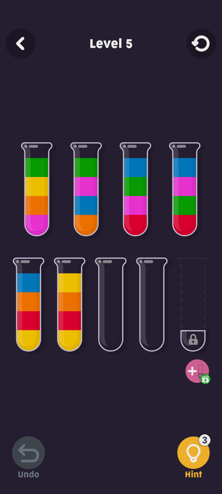

# Water Sort Solver
## Water sort
Water sort is a fun game.
The objective is to sort cylinders filled with colored water by pouring cylinders from one to another.

I used the version featured in the following Android app: https://play.google.com/store/apps/details?id=com.JindoBlu.OfflineGames&hl=en

## About
Water sort solver is a solver for Water sort for when you are to lazy to think.

This repository hosts two programs: a reader and a solver.
`reader.py` accepts a screenshot of the game state and (with a bit of luck!) outputs a format that can be understood by the solver.
The solver, as implemented in app/Main.hs, accepts a configuration of the game and tries to find a solution.
The solver expects the state of the game as a collection of cylinders, separated by newlines. Each row contains one cylinder. A cylinder is represented by a row of space-separated numbers. Each number represents a unique color. The letter 'E' is used to denote the empty color.

## How to run
See `example.sh` on how to run the solver and the reader together.
The solver accepts an option "-v" to visualize the steps for reading the game.
This option is useful for understanding and debugging the reader.
Some values are hardcoded and might need to be adapted for different devices.

## Dependencies
1. Install Haskell cabal.
2. Install python3.
3. Install python3-numpy.
4. Install python3-opencv2.

## Screenshot of the game

